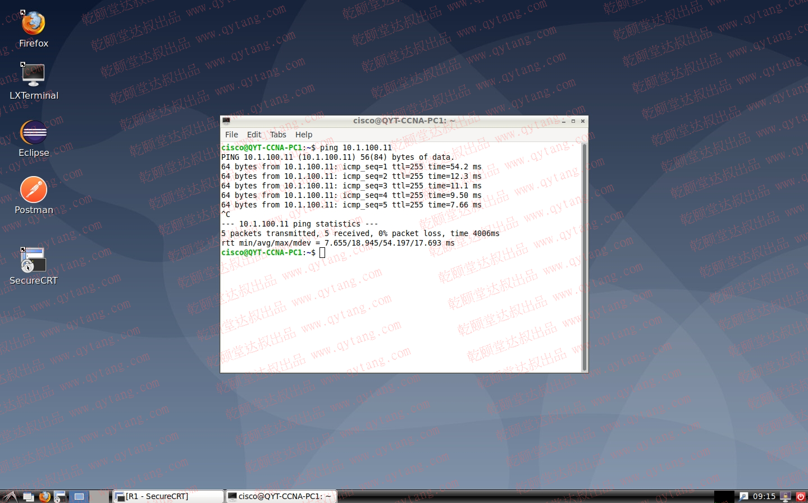
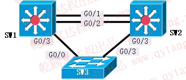

# 乾颐堂EICCNA VIP专享在线实战手册


### **【CCNA基础实验知识点分布构架图】**


### **【CCNA 综合实战拓扑】**


### 【实验01】IOS 系统基本操作、特权模式、全局配置模式、配置及验证主机名

【实验目的】
- 通过本实验了解掌握思科catalyst系统交换机的基础命令。

【实验原理】
> Cisco Catalyst 系列交换机所使用的操作系统是 IOS ( Internetwork Operating System,互联网际操作系统)或cos(Catalyst Operating System) ,其中以 IOS 使用最为广泛,该操作系统和路由器所使用的操作系统都基于相同的类linux内核和shell.
> IOS 的优点在于命令体系比较易用。利用操作系统所提供的命令,可实现对交换机的配置和管理。Cisco IOS 操作系纲具有以下特点:

    - (1)支持通过命令行(Command-Line Interface ,简称 CLI )或Web界面,来对交换机进行配置和管理。
    - (2)支持通过交换机的控制端口(Console)或TeInet会话来登录连接访问交换机。
    - (3)提供有用户模式(user level )和特权模式(privileged level)两种命令执行级别,并提供有全局配置、接口配置、子接口配置和vlan数据库配置等多种级别的配置模式,以允许用户对交换机的资源进行配置。
    - (4)在用户模式,仅能运行少数的命令,允许查看当前配置信息,但不能对交换机进行配置。特权模式允许运行提供的所有命令。
    - (5) IOS 命令不区分大小写。
    - (6)在不引起混淆的情况下,支持命令简写。比如enable通常可简约表达为en。
    - (7)可随时使用?来获得命令行帮助,支持命令行编辑功能,并可将执行过的命令保存下来,供进行历史命令查询。

【实验步骤】
1. 打开实验环境，使用CRT连接设备concole接口

2. 进入用户EXEC模式
Switch>
//当用户通过交换机的控制台端口或Telnet会话连接并登录到交换机时,此时所处的命令执行模式就是用户EXEC模式。
用户EXEC模式的命令状态行是Switch>
在该模式下,只执行有限的一组命令,这些命令通常用于查看显示系统信息、改变终端设置和执行一些最基本的测试命令,如ping, traceroute等。
其中的Switch是交换机的主机名,对于未配置的交换机默认的主机名是Switch。在用户EXEC模式下,直接输入?回车,可获得在该模式下允许执行的命令帮助。

3. 进入特权EXEC模式
Switch>enable
Switch#
//在用户EXEC模式下,执行enable命令,将进入到特权EXEC模式。在该模式下,用户能够执行 IOS 提供的所有命令。若进入特权EXEC模式的密码未设置或要修改,可在全局配置模式下,利用enable secret命令进行设置。
特权EXEC模式的命令状态行为: Switch#
在该模式下键入? ,可获得允许执行的全部命令的提示。离开特权模式,返回用户模式,可执行exit或disable命令。重新启动交换机,可执行reload命令。

4. 进入全局配置模式
Switch#config terminal
Switch(config)#
//在特权模式下,执行configure terminal命令,即可进入全局配置模式。在该模式下,只要输入一条有效的配置命令并回车,内存中正在运行的配置就会立即改变生效。
该模式下的配置命令的作用域是全局性的,是对整个交换机起作用。
全局配置模式的命令状态行为:Switch(config)#
在全局配置模式,还可进入接口配置、line配置等子模式。从子模式返回全局配置模式,执行exit命令;
从全局配量模式返回特权模式,执行exit命令;
若要退出任何配置模式,直接返回特权模式,则要直接end命令或按 Ctrl+z 组合键。

5. 查看交换机的 IOS 版本
Switch#show version
//查看交换机的 IOS 版本

6. 修改交换机设备名称
Switch(config)#hostname  SW1
SW1(config)#
//例如,若要设交换机名称为SW1,则可使用hostname命令来设置，交换机名即被修改

7. 重复步骤（7），为所有设备配置对应的主机名字；

8. 显示当前正在运行及保存的配置
    SW1#show running-config
    //显示当前正在运行的配置
    SW1#show startup-config
    //显示保存在 NVRAM 中的启动配置

【实验总结】
- 通过本次实验，理解了掌握了思科catalyst系统交换机的基础命令能力；
***

### 【实验02】配置及验证远程管理（telnet、SSH）
【实验目的】
- 学会cisco企业级路由器、交换机的远程管理配置；

【实验原理】
- 本实验通过在网络设备上配置IP地址，并在客户端上使用IP地址通过远程管理协议对网络设备进行基于TCP/IP的远程登录及管理；

【实验步骤】
1. 打开实验环境，使用CRT连接设备concole接口
2. 为PC1配置一个IP地址，以便实现与SW3的IP连通性，为后续实现基于TCP/IP的远程管理做准备；


3. 为SW3配置一个管理地址；
```
SW3>enable
SW3#configure terminal 
Enter configuration commands, one per line.  End with CNTL/Z.
SW3(config)#interface vlan 1
SW3(config-if)#ip address 10.1.100.33 255.255.255.0
SW3(config-if)#no shutdown
SW3(config-if)#exit
```

4. 测试PC1与SW3的连通性；


linux系统需要按键盘上的 ctrl + c 键停止 ICMP 探测；

5. 为SW3配置用户名和密码，以便将来通过用户名和密码对设备进行远程登录及管理；
```
SW3(config)#username saiban password saiban
```

6. 为SW3配置特权密码，这一步骤非常重要；
```
SW3(config)#enable password saiban
```

7. 为SW3配置VTY（virtual terminal line）使用设备本地用户名和密码登录，并允许telnet以及ssh协议接入；
```
SW3(config)#line vty 0 4
SW3(config-line)#login local
SW3(config-line)#transport input telnet ssh
SW3(config-line)#end
```

8. 在PC1上通过telnet连接SW3；

       

9. 为SW3配置SSH登录所需域名及密钥
```
SW3(config)#ip domain name qyteiccie.com
SW3(config)#crypto key generate rsa modulus 1024
The name for the keys will be: SW3.qyteiccie.com

% The key modulus size is 1024 bits
% Generating 1024 bit RSA keys, keys will be non-exportable...
[OK] (elapsed time was 0 seconds)

SW3(config)#
*Sep  9 08:05:56.098: %SSH-5-ENABLED: SSH 1.99 has been enabled
```

10. 在PC1上通过ssh连接SW3；

       

       

       

       

       

       

       

     

11. 在SW3上查看远程登录的用户相关信息；
```
    SW3>who
        Line       User       Host(s)              Idle       Location
       0 con 0                idle                 00:00:02   
    *  2 vty 0     qytang     idle                 00:00:00 10.1.100.1
      Interface    User               Mode         Idle     Peer Address
    SW3>
```

【实验总结】
- 在实际生产环境中，我们的网络设备通常放置在公司机房、IDC、数据中心等物理位置。因此，掌握通过TCP/IP远程管理网络设备的能力，是一名网络工程师必备的基本技能。
***

### 【实验03】观察交换机的MAC地址表
【实验目的】
- 掌握查看交换机MAC地址表的操作及认知能力，理解 MAC 地址表的作用；

【实验原理】
- 交换机接口一旦收到数据帧，就将数据帧当中源MAC地址与收到数据帧接口之间的映射关系记录在CAM中，这种具有可寻址能力的专用内存被人们形象的称为mac地址表；

【实验步骤】
1. 打开实验环境，使用CRT连接设备concole接口；

2. 在PC1上使用ping指令测试与SW3的IP连通性；

   

   

3. 在SW3上执行CLI指令，查看交换机的MAC地址表；
```
   SW3>show mac address-table 
             Mac Address Table
   -------------------------------------------

   Vlan    Mac Address       Type        Ports
   ----    -----------       --------    -----
      1    0050.56a1.6b17    DYNAMIC     Gi0/0
      1    0050.56a1.7f08    DYNAMIC     Gi0/0
      1    0050.56a1.b6d5    DYNAMIC     Gi0/0
      1    0050.56a1.b821    DYNAMIC     Gi0/2
   ** 1    0050.56a1.c6aa    DYNAMIC     Gi0/1 **
      1    0050.56a1.cfd4    DYNAMIC     Gi0/0
      1    5555.5555.5555    DYNAMIC     Gi0/0
   Total Mac Addresses for this criterion: 7
```
4. 如何查看 debian 系统的网卡配置呢？如图所示；
  

【实验总结】

- 观察SW3的 mac 地址表，其中Gi0/1接口上学习到的MAC地址即是 PC1 NIC 的 MAC 地址。

***

### 【实验04】观察跨越交换机通信的交换机MAC地址表情况
【实验目的】
- 理解跨越交换机的二层通信原理；

【实验拓扑】


【实验步骤】

1. 打开实验环境，使用CRT连接设备concole接口；

2. 在R1的G0/2接口上配置IP地址 10.1.100.11/24 并开启接口；
```
R1>enable
R1#configure terminal 
Enter configuration commands, one per line.  End with CNTL/Z.
R1(config)#interface g0/2
R1(config-if)#ip address 10.1.100.11 255.255.255.0
R1(config-if)#no shutdown
R1(config-if)#end
R1#
*Sep 10 09:13:16.705: %LINK-3-UPDOWN: Interface GigabitEthernet0/2, changed state to up
*Sep 10 09:13:17.264: %SYS-5-CONFIG_I: Configured from console by console
*Sep 10 09:13:17.705: %LINEPROTO-5-UPDOWN: Line protocol on Interface GigabitEthernet0/2, changed state to up
R1#
```

3. 在PC1上测试与R1的IP连通性；
      
  
4. 如何查看路由器接口的MAC地址呢？我们介绍一种简单直观的方法；
```
R1>show arp
Protocol  Address          Age (min)  Hardware Addr   Type   Interface
Internet  10.1.100.1              5   0050.56a1.c6aa  ARPA   GigabitEthernet0/2
Internet  10.1.100.11             -   0050.56a1.28e2  ARPA   GigabitEthernet0/2
```
我们可以通过查看路由器的ARP记录，从而直观的看到路由器每个接口的MAC地址和接口的对应关系，当然也包括本设备获取到的相关ARP记录，有关ARP的知识点会在后续课程中学习到；

5. 查看SW1的MAC地址表，主要关注PC1和R1的记录项；
```
SW1>show mac address-table 
          Mac Address Table
-------------------------------------------

Vlan    Mac Address       Type        Ports
----    -----------       --------    -----
   1    0050.5301.1001    DYNAMIC     Gi0/3
** 1    0050.56a1.28e2    DYNAMIC     Gi0/0 **
   1    0050.56a1.6b17    DYNAMIC     Gi0/1
   1    0050.56a1.7f08    DYNAMIC     Gi0/2
   1    0050.56a1.b821    DYNAMIC     Gi0/3
** 1    0050.56a1.c6aa    DYNAMIC     Gi0/3 **
   1    0050.56a1.cfd4    DYNAMIC     Gi0/1
   1    5555.5555.5555    DYNAMIC     Gi0/0
Total Mac Addresses for this criterion: 8
```

6. 查看SW3的MAC地址表，主要关注PC1和R1的记录项；
```
SW3>show mac address-table 
          Mac Address Table
-------------------------------------------

Vlan    Mac Address       Type        Ports
----    -----------       --------    -----
** 1    0050.56a1.28e2    DYNAMIC     Gi0/0 **
   1    0050.56a1.6b17    DYNAMIC     Gi0/0
   1    0050.56a1.7f08    DYNAMIC     Gi0/0
   1    0050.56a1.b6d5    DYNAMIC     Gi0/0
   1    0050.56a1.b821    DYNAMIC     Gi0/2
** 1    0050.56a1.c6aa    DYNAMIC     Gi0/1 **
   1    0050.56a1.cfd4    DYNAMIC     Gi0/0
   1    5555.5555.5555    DYNAMIC     Gi0/0
Total Mac Addresses for this criterion: 8
```

【实验总结】
- 通过上述观察，当产生跨越多台交换机的二层通讯时，交换机的MAC地址表成为了跨越多台交换机转发数据帧时的重要依据；  


***
### 【实验05】配置及验证 vlan
【实验目的】

- 掌握 catalyst 系统交换机的 vlan 配置；本实验将带领大家掌握两种 vlan 的配置方式；

【实验原理】

- 在交换机上将端口划分到不同的端口组，不同端口组之间的主机无法二层通信，以此实现广播域的隔离；

【实验步骤】
  
1. 打开实验环境，使用CRT连接设备concole接口；

2. 在 SW3 上配置两个 vlan，分别给定 vlan 名字为 employees 和 service；
```
SW3(config)#vlan 100
SW3(config-vlan)#name employees
SW3(config-vlan)#exit
SW3(config)#vlan 200
SW3(config-vlan)#name service
SW3(config-vlan)#exit
```

3. 将 SW3 的 G0/1 接口和 G0/2 接口配置为 access 模式并分别指派给 emoloyees vlan 和 service vlan；
```
SW3(config)#interface g0/1
SW3(config-if)#switchport mode access
SW3(config-if)#switchport access vlan 100
SW3(config-if)#exit
SW3(config)#interface g0/2            
SW3(config-if)#switchport mode access    
SW3(config-if)#switchport access vlan 200
SW3(config-if)#end           
```

4. 验证 SW3 上的 vlan 配置；
```
SW3#show vlan brief 

VLAN Name                             Status    Ports
---- -------------------------------- --------- -------------------------------
1    default                          active    Gi0/0, Gi0/3
100  employees                        active    Gi0/1
200  service                          active    Gi0/2
1002 fddi-default                     act/unsup 
1003 token-ring-default               act/unsup 
1004 fddinet-default                  act/unsup 
1005 trnet-default                    act/unsup 
```

5. 在 SW4 上使用另外一种方法批量创建 vlan，但这种方法不能直接配置名字，仅适合批量创建 vlan；
```
SW4>enable
SW4#configure terminal 
Enter configuration commands, one per line.  End with CNTL/Z.
SW4(config)#vlan 100,200 
SW4(config-vlan)#exit
```

6. 将 SW4 的 G0/1 接口和 G0/2 接口配置为 access 模式并分别指派给 vlan 100 和 vlan 200；
```
SW4(config)#interface g0/1
SW4(config-if)#switchport mode access
SW4(config-if)#switchport access vlan 100
SW4(config-if)#exit
SW4(config)#interface g0/2            
SW4(config-if)#switchport mode access    
SW4(config-if)#switchport access vlan 200
SW4(config-if)#end   
```

7. 验证 SW4 上的 vlan 配置；
```
SW4#show vlan brief 

VLAN Name                             Status    Ports
---- -------------------------------- --------- -------------------------------
1    default                          active    Gi0/0, Gi0/3
100  VLAN0100                         active    Gi0/1
200  VLAN0200                         active    Gi0/2
1002 fddi-default                     act/unsup 
1003 token-ring-default               act/unsup 
1004 fddinet-default                  act/unsup 
1005 trnet-default                    act/unsup 
```

【实验总结】
- 通过本次实验，应掌握创建 vlan、配置 vlan name、将端口配置为 access 模式并指派到 vlan 的操作能力；

***
### 【实验06】配置及验证trunk
【实验目的】
- 掌握在交换机接口上配置 trunk 的能力；

【实验原理】
- 如果没有Trunk功能，在交换机之间承载多个VLAN流量时需要和VLAN数目相同的链路，所以为了节省链路和接口，需要Trunk。Trunk允许多个VLAN流量在同一链路转发。通过帧中的Tag字段指定VLAN流量的归属。基于帧把相应VLAN的信息转发到端口。

【实验步骤】


1. 打开实验环境，使用CRT连接设备concole接口
2. 在交换机之间的所有链路上配置基于 802.1q 的trunk；
```
SW1(config)#interface range g0/1-3
SW1(config-if-range)#switchport trunk encapsulation dot1q 
SW1(config-if-range)#switchport mode trunk                
SW1(config-if-range)#end
SW1#

SW2(config)#interface range g0/1-3
SW2(config-if-range)#switchport trunk encapsulation dot1q 
SW2(config-if-range)#switchport mode trunk 
SW2(config-if-range)#end

SW3(config)#interface range g0/0,g0/3
SW3(config-if-range)#switchport trunk encapsulation dot1q 
SW3(config-if-range)#switchport mode trunk 
SW3(config-if-range)#end
```

3. 查看交换机上的 trunk 链路（验证配置效果）；
```
SW1#show interfaces trunk 

Port        Mode             Encapsulation  Status        Native vlan
Gi0/1       on               802.1q         trunking      1
Gi0/2       on               802.1q         trunking      1
Gi0/3       on               802.1q         trunking      1

Port        Vlans allowed on trunk
Gi0/1       1-4094
Gi0/2       1-4094
Gi0/3       1-4094

Port        Vlans allowed and active in management domain
Gi0/1       1
Gi0/2       1
Gi0/3       1

Port        Vlans in spanning tree forwarding state and not pruned
Gi0/1       1
Gi0/2       1
Gi0/3       1
```

【实验总结】
- 通过本次实验，应掌握在交换机接口上配置 trunk 的能力，掌握验证交换机接口 trunk 工作情况的能力；

***
### 【实验07】配置及验证以太通道
【实验目的】
- 掌握静态以太通道的配置，理解以太通道作用；

【实验原理】
- trunk链路可以承载多个vlan的流量，那么就意味着单个物理链路能承载的网络流量增加了，非常容易导致该trunk链路拥塞。当然可以通过更新硬件，通过增加物理链路解决，但是这意味着成本的增加。一味的增加上行链路是不具备扩展性的方案。以太链路通道可以把多个物理链路捆绑到一起形成一个逻辑链路，以提升带宽，该逻辑链路被当成一个链路存在。
共有三种方式去配置以太通道：静态方式，思科私有的PAgP和公有标准LACP
如下参数必须匹配才能工作:
Speed and duplex
工作Mode (access or trunk)
本征vlan相同，trunk上允许通过的vlan相同
access接口上划入相同的vlan

【实验步骤】


1. 打开实验环境，使用CRT连接设备concole接口；

2. 配置以太通道；
```
   SW1(config)#interface range g0/1-2
   SW1(config-if-range)#channel-group 1 mode on 
   Creating a port-channel interface Port-channel 1
   SW1(config-if-range)#end
   
   SW2(config)#interface range g0/1-2
   SW2(config-if-range)#channel-group 1 mode on 
   Creating a port-channel interface Port-channel 1
   SW2(config-if-range)#end
```
3. 验证以太通道工作状态；
```
SW1#show etherchannel summary 
Flags:  D - down        P - bundled in port-channel
        I - stand-alone s - suspended
        H - Hot-standby (LACP only)
        R - Layer3      S - Layer2
        U - in use      N - not in use, no aggregation
        f - failed to allocate aggregator

        M - not in use, minimum links not met
        m - not in use, port not aggregated due to minimum links not met
        u - unsuitable for bundling
        w - waiting to be aggregated
        d - default port

        A - formed by Auto LAG


Number of channel-groups in use: 1
Number of aggregators:           1

Group  Port-channel  Protocol    Ports
------+-------------+-----------+-----------------------------------------------
1      Po1(SU)          -        Gi0/1(P)    Gi0/2(P)    
```
4. 查看以太通道接口；
```
SW1#show interfaces port-channel 1
Port-channel1 is up, line protocol is up (connected) 
  Hardware is EtherChannel, address is 0050.56a1.7a9b (bia 0050.56a1.7a9b)
  MTU 1500 bytes, BW 2000000 Kbit/sec, DLY 10 usec,    //带宽为200Mbps//
     reliability 255/255, txload 1/255, rxload 1/255
  Encapsulation ARPA, loopback not set
  Keepalive set (10 sec)
  ARP type: ARPA, ARP Timeout 04:00:00
  Last input 00:01:16, output never, output hang never
  Last clearing of "show interface" counters never
  Input queue: 0/2000/0/0 (size/max/drops/flushes); Total output drops: 0
  Queueing strategy: fifo
  Output queue: 0/40 (size/max)
  5 minute input rate 0 bits/sec, 0 packets/sec
  5 minute output rate 0 bits/sec, 0 packets/sec
     118 packets input, 6867 bytes, 0 no buffer
     Received 0 broadcasts (0 multicasts)
     0 runts, 0 giants, 0 throttles 
     0 input errors, 0 CRC, 0 frame, 0 overrun, 0 ignored
     0 input packets with dribble condition detected
     254 packets output, 18308 bytes, 0 underruns
     0 output errors, 0 collisions, 0 interface resets
     0 unknown protocol drops
     0 babbles, 0 late collision, 0 deferred
     0 lost carrier, 0 no carrier
     0 output buffer failures, 0 output buffers swapped out
```
【实验总结】
- 两个接口被捆绑到以太通道组1（本地意义，两端可不相同），S代表是二层，U代表可用，P代表绑定成功,没有使用任何协议协商以太通道；
- 捆绑之后的带宽为20Mbps；
***
### 【实验08】配置及验证RSTP
【实验目的】
- 通过配置生成树协议版本，掌握观察生成树协议工作状态的能力，理解生成树工作原理；

【实验原理】
- 网桥之间传递特殊的消息BPDU（Bridge Protocol Data Unit桥协议数据单元）包含足够的信息做以下工作：
从网络中的所有网桥中，选出一个作为根网桥（Root Bridge）；
计算本网桥到根网桥的最短路径（Cost）；
对每个交换的段（即设备相连的链路），选出离根桥最近的那个网桥作为指定网桥（Designate Bridge），负责所在LAN上的数据转发，选择出负责在该LAN上转发数据的指定端口（Designate Port），同时该端口也可以中继来自根的最优的BPDU；
每个网桥选择一个唯一的根端口（Root Port），该端口给出的路径是此网桥到根桥的最佳路径.负责接收最优的BPDU；
网桥根据BPDU中的内容形成STP生成树的基本表项；

【实验步骤】

1. 打开实验环境，使用CRT连接设备concole接口
2. 查看交换机当前生成树工作版本；
```
SW1#show spanning-tree 

VLAN0001
  Spanning tree enabled protocol ieee  //当前工作版本为标准生成树//
  Root ID    Priority    32769
             Address     0050.5101.1001
             This bridge is the root
             Hello Time   2 sec  Max Age 20 sec  Forward Delay 15 sec

  Bridge ID  Priority    32769  (priority 32768 sys-id-ext 1)
             Address     0050.5101.1001
             Hello Time   2 sec  Max Age 20 sec  Forward Delay 15 sec
             Aging Time  300 sec

Interface           Role Sts Cost      Prio.Nbr Type
------------------- ---- --- --------- -------- --------------------------------
Gi0/0               Desg FWD 4         128.1    Shr 
Gi0/3               Desg FWD 4         128.4    Shr 
Po1                 Desg FWD 3         128.65   Shr 
```
3. 修改SW1、SW2、SW3三台交换机的协议工作版本；
```
SW1(config)#spanning-tree mode rapid-pvst 
SW2(config)#spanning-tree mode rapid-pvst 
SW3(config)#spanning-tree mode rapid-pvst 
```
4. 查看生成树协议工作状态；
```
SW1#show spanning-tree 

VLAN0001
  Spanning tree enabled protocol rstp  //当前工作版本为快速生成树//
  Root ID    Priority    32769
             Address     0050.5101.1001
             This bridge is the root  //本交换机为根网桥//
             Hello Time   2 sec  Max Age 20 sec  Forward Delay 15 sec

  Bridge ID  Priority    32769  (priority 32768 sys-id-ext 1)
             Address     0050.5101.1001
             Hello Time   2 sec  Max Age 20 sec  Forward Delay 15 sec
             Aging Time  300 sec

Interface           Role Sts Cost      Prio.Nbr Type
------------------- ---- --- --------- -------- --------------------------------
Gi0/0               Desg FWD 4         128.1    Shr 
Gi0/3               Desg FWD 4         128.4    Shr 
Po1                 Desg FWD 3         128.65   Shr 
```

```
SW2#show spanning-tree 

VLAN0001
  Spanning tree enabled protocol rstp
  Root ID    Priority    32769  //根交换机的桥优先级//
             Address     0050.5101.1001  //根交换机的桥MAC//
             Cost        3  //根桥路径开销为3//
             Port        65 (Port-channel1)  //根端口//
             Hello Time   2 sec  Max Age 20 sec  Forward Delay 15 sec

  Bridge ID  Priority    32769  (priority 32768 sys-id-ext 1)  //本机桥优先级//
             Address     0050.5201.1001  //本机桥MAC//
             Hello Time   2 sec  Max Age 20 sec  Forward Delay 15 sec
             Aging Time  300 sec  //MAC地址老化时间为300秒//

Interface           Role Sts Cost      Prio.Nbr Type
------------------- ---- --- --------- -------- --------------------------------
Gi0/0               Desg FWD 4         128.1    Shr 
Gi0/3               Desg FWD 4         128.4    Shr 
Po1                 Root FWD 3         128.65   Shr 
```


【实验总结】
- 通过本次实验，应掌握生成树协议工作版本的配置操作，能够看懂生成树工作状态表项，理解生成树工作原理；
***
### 【实验09】静态路由
【实验目的】
- 掌握静态路由的配置及工作原理，理解数据包在网络中转发时路由起到的作用。

【实验原理】
- 路由器根据数据包中的目标IP地址与路由器路由表中的路由条目进行匹配，依据路由原理决定匹配项，做出数据转发决策。

【实验步骤】


1. 打开实验环境，使用CRT连接设备concole接口
2. 为R1和R3的互联网接口配置IP地址；
```
R1(config)#interface g0/0
R1(config-if)#ip address 202.100.1.2 255.255.255.252
R1(config-if)#no shutdown
R1(config-if)#exit

R1(config)#interface g0/1
R1(config-if)#ip address 202.100.1.6 255.255.255.252
R1(config-if)#no shutdown                           
R1(config-if)#end
```
```
R3(config)#interface g0/0
R3(config-if)#ip address 61.128.1.2 255.255.255.252
R3(config-if)#no shutdown
R3(config-if)#end
```
3. 验证与互联网服务商直连网络的IP连通性；
```
R1#ping 202.100.1.1
Type escape sequence to abort.
Sending 5, 100-byte ICMP Echos to 202.100.1.1, timeout is 2 seconds:
.!!!!
Success rate is 80 percent (4/5), round-trip min/avg/max = 1/1/1 ms
R1#ping 202.100.1.5
Type escape sequence to abort.
Sending 5, 100-byte ICMP Echos to 202.100.1.5, timeout is 2 seconds:
.!!!!
Success rate is 80 percent (4/5), round-trip min/avg/max = 1/1/1 ms

R3#ping 61.128.1.1
Type escape sequence to abort.
Sending 5, 100-byte ICMP Echos to 61.128.1.1, timeout is 2 seconds:
.!!!!
Success rate is 80 percent (4/5), round-trip min/avg/max = 1/1/1 ms
```
4. 配置静态路由；
```
R1(config)#ip route 61.128.1.0 255.255.255.252 g0/0 202.100.1.1
```
```
R3(config)#ip route 202.100.1.0 255.255.255.252 g0/0 61.128.1.1
```
5. 测试R1和R3之间的互联网连通性；
```
R1#ping 61.128.1.2
Type escape sequence to abort.
Sending 5, 100-byte ICMP Echos to 61.128.1.2, timeout is 2 seconds:
!!!!!
Success rate is 100 percent (5/5), round-trip min/avg/max = 1/1/2 ms
```
6. 配置静态默认路由；
```
R1(config)#ip route 0.0.0.0 0.0.0.0 g0/0 202.100.1.1
```
```
R3(config)#ip route 0.0.0.0 0.0.0.0 g0/0 61.128.1.1
```
7. 测试到达互联网的连通性
```
R1#ping 8.8.8.8
Type escape sequence to abort.
Sending 5, 100-byte ICMP Echos to 8.8.8.8, timeout is 2 seconds:
!!!!!
Success rate is 100 percent (5/5), round-trip min/avg/max = 1/1/2 ms
```
```
R3#ping 8.8.8.8
Type escape sequence to abort.
Sending 5, 100-byte ICMP Echos to 8.8.8.8, timeout is 2 seconds:
!!!!!
Success rate is 100 percent (5/5), round-trip min/avg/max = 1/1/2 ms
```

【实验总结】
- 通过本次实验：
- 掌握了配置及验证静态路由的操作方法；
- 理解了路由的作用及路由的基本原理；
- 了解了数据包通过路由转发的基本过程；
- 初步了解到ICMP的基本作用；

***
### 【实验10】浮动静态路由
【实验目的】
- 理解浮动静态路由原理，掌握浮动静态路由的配置及验证操作能力；

【实验原理】
- 默认情况下，当一个路由器接口down时，关联在该接口上的静态路由也会随之失效；

【实验步骤】


1. 打开实验环境，使用CRT连接设备concole接口
2. 在R1上关闭G0/0接口，模拟互联网链路故障；
```
R1(config)#interface g0/0
R1(config-if)#shutdown 
R1(config-if)#exit
R1(config)#
```
3. 测试R1到达互联网的IP连通性；
```
R1(config)#do ping 8.8.8.8
```
4. 在R1上删除上一实验中的静态路由，配置另外一条默认路由，经由G0/1将数据转发至运营商，并指定管理距离为 10；
```
R1(config)#no ip route 61.128.1.0 255.255.255.252 GigabitEthernet0/0 202.100.1.1
R1(config)#ip route 0.0.0.0 0.0.0.0 g0/1 202.100.1.5 10
```
5. 再次测试R1到达互联网的IP连通性；
```
R1#ping 8.8.8.8
Type escape sequence to abort.
Sending 5, 100-byte ICMP Echos to 8.8.8.8, timeout is 2 seconds:
!!!!!
Success rate is 100 percent (5/5), round-trip min/avg/max = 1/1/1 ms
```
6. 观察R1的静态路由表；
```
R1#show ip route static | begin Gateway 
Gateway of last resort is 202.100.1.5 to network 0.0.0.0

S*    0.0.0.0/0 [10/0] via 202.100.1.5, GigabitEthernet0/1  //出接口指向了G0/1//
```
7. 开启R1的G0/0接口，再次观察R1的静态路由表；
```
R1(config)#interface g0/0
R1(config-if)#no shutdown 
R1(config-if)#end

R1#show ip route static | begin Gateway
Gateway of last resort is 202.100.1.1 to network 0.0.0.0

S*    0.0.0.0/0 [1/0] via 202.100.1.1, GigabitEthernet0/0  //出接口自动跳转到了G0/0//
```
8. 再次测试R1到达互联网的IP连通性；
```
R1#ping 8.8.8.8
Type escape sequence to abort.
Sending 5, 100-byte ICMP Echos to 8.8.8.8, timeout is 2 seconds:
!!!!!
Success rate is 100 percent (5/5), round-trip min/avg/max = 1/1/2 ms
```

【实验总结】
- 本实验说明了默认情况下，当一个路由器接口down时，关联在该接口上的静态路由也会随之失效；
- 应理解浮动静态路由原理，掌握浮动静态路由的配置及验证操作能力；
- 应理解路由管理距离的意义。
***
### 【实验11】环回口部署公网IP地址对外服务
【实验目的】
- 理解环回接口部署公网IP地址的意义；
【实验原理】
- 当存在多条互联网链路时，在环回口上部署独立的公网IP地址，可以实现对外提供稳定的IP服务；

【实验步骤】


1. 打开实验环境，使用CRT连接设备concole接口
2. 在R1上配置一个环回接口，注意本实验中IP地址必须固定为 137.78.1.1/32，其中互联网IP路由服务由ISP负责提供；
```
R1(config)#interface loopback 0
R1(config-if)#ip address 137.78.1.1 255.255.255.255
R1(config-if)#end
R1#
```
3. 在R3上测试到达 137.78.1.1 的IP连通性；
```
R3>ping 137.78.1.1
Type escape sequence to abort.
Sending 5, 100-byte ICMP Echos to 137.78.1.1, timeout is 2 seconds:
!!!!!
Success rate is 100 percent (5/5), round-trip min/avg/max = 1/1/2 ms
R3>
```
4. 关闭R1的G0/0接口，再次在R3上测试到达 137.78.1.1 的IP连通性；
```
R1(config)#interface g0/0
R1(config-if)#shutdown

R3>ping 137.78.1.1
Type escape sequence to abort.
Sending 5, 100-byte ICMP Echos to 137.78.1.1, timeout is 2 seconds:
!!!!!
Success rate is 100 percent (5/5), round-trip min/avg/max = 1/1/2 ms
R3>
```
5. 开启R1的G0/0接口；
```
R1(config-if)#no shutdown 
R1(config-if)#end
R1#
```

【实验总结】
- 使用环回接口对外提供服务，可以实现多链路冗余，服务稳定且故障切换时对用户透明；
***
### 【实验12】ROAS
【实验目的】
掌握单臂路由配置。

【实验原理】
在路由器上部署基于802.1q的逻辑子接口，处理经由交换机trunk链路转发过来的携带特定vlan tag的数据帧。
路由器接收携带802.1q

【实验步骤】

1. 打开实验环境，使用CRT连接设备concole接口
2. 配置SW4的上行接口（G0/0）为 trunk；
```tex
sw4#configure terminal 
Enter configuration commands, one per line.  End with CNTL/Z.
sw4(config)#interface g0/0
sw4(config-if)#switchport trunk encapsulation dot1q 
sw4(config-if)#switchport mode trunk 
```

3. R3创建子接口、配置dot1q封装、配置IP地址
```tex
R3(config)#int g0/1
R3(config-if)#no shutdown 
R3(config)#interface g0/1.1
R3(config-subif)#encapsulation dot1Q 100     
R3(config-subif)#ip address 10.2.100.254 255.255.255.0
R3(config-subif)#interface g0/1.2                     
R3(config-subif)#encapsulation dot1Q 200              
R3(config-subif)#ip address 10.2.200.254 255.255.255.0
```
4. PC2手动设置vnic的网络


5. 测试及验证ROAS
```tex
R3#show ip route | begin Gateway
Gateway of last resort is 61.128.1.1 to network 0.0.0.0

S*    0.0.0.0/0 [1/0] via 61.128.1.1, GigabitEthernet0/0
      10.0.0.0/8 is variably subnetted, 4 subnets, 2 masks
**C        10.2.100.0/24 is directly connected, GigabitEthernet0/1.1**
L        10.2.100.254/32 is directly connected, GigabitEthernet0/1.1
**C        10.2.200.0/24 is directly connected, GigabitEthernet0/1.2**
L        10.2.200.254/32 is directly connected, GigabitEthernet0/1.2
      61.0.0.0/8 is variably subnetted, 2 subnets, 2 masks
C        61.128.1.0/30 is directly connected, GigabitEthernet0/0
L        61.128.1.2/32 is directly connected, GigabitEthernet0/0
      202.100.1.0/30 is subnetted, 1 subnets
S        202.100.1.0 [1/0] via 61.128.1.1, GigabitEthernet0/0
```


***
### 【实验13】通过SVI实现VLAN间路由
【实验目的】
掌握交换机svi接口的配置；
理解svi接口工作原理；

【实验原理】
catalyst系列多层交换机上，支持数据包路由能力；
可以将交换接口切换为路由接口，并可以配置ip地址；
svi接口的接口id即该接口绑定到的vlan广播域；
svi接口up的前提是：交换机上存在对应vlan，至少有一个接口属于该vlan；

【实验步骤】
1. 打开实验环境，使用CRT连接设备concole接口
2. 按照拓扑图配置R1、sw1、sw2直连接口的IP地址；

```tex
R1#conf terminal 
R1(config)#interface g0/2
R1(config-if)#ip add 10.1.11.1 255.255.255.252
R1(config-if)#int g0/3
R1(config-if)#ip add 10.1.12.1 255.255.255.252
R1(config-if)#no shutdown
R1(config)#end
```
```tex
sw1>enable 
sw1#configure terminal 
sw1(config)#interface g0/0
sw1(config-if)#no switchport 
sw1(config-if)#ip address 10.1.11.2 255.255.255.252
sw1(config-if)#end
```
```tex
sw2>enable 
sw2#configure terminal 
sw2(config)#interface g0/0
sw2(config-if)#no switchport 
sw2(config-if)#ip address 10.1.12.2 255.255.255.252
sw2(config-if)#end
```

3. 在sw1和sw2上配置vlan12,100,200；

   ```tex
   sw1#configure terminal 
   sw1(config)#vlan 12,100,200
   sw1(config-vlan)#exit
   
   sw2#configure terminal 
   sw2(config)#vlan 12,100,200
   sw2(config-vlan)#exit
   ```

4. 在sw1和sw2上配置svi接口及ip地址；

   ```tex
   sw1(config)#interface vlan 12
   sw1(config-if)#ip address 10.1.112.1 255.255.255.252
   sw1(config-if)#no shutdown
   sw1(config-if)#interface vlan 100                   
   sw1(config-if)#ip address 10.1.100.252 255.255.255.0
   sw1(config-if)#no shutdown           
   sw1(config-if)#interface vlan 200
   sw1(config-if)#ip address 10.1.200.252 255.255.255.0
   sw1(config-if)#no shutdown                      
   sw1(config-if)#exit
   ```

   ```tex
   sw2(config)#interface vlan 12
   sw2(config-if)#ip address 10.1.112.2 255.255.255.252
   sw2(config-if)#no shutdown
   sw2(config-if)#interface vlan 100                         
   sw2(config-if)#ip address 10.1.100.253 255.255.255.0  
   sw2(config-if)#no shutdown                          
   sw2(config-if)#interface vlan 200                   
   sw2(config-if)#ip address 10.1.100.253 255.255.255.0
   sw2(config-if)#no shutdown                          
   sw2(config-if)#exit
   ```

5. 开启sw1和sw2的ipv4单播路由能力；

   ```tex
   sw1(config)#ip routing
   sw2(config)#ip routing
   ```

6. 在R1上配置静态路由到vlan100，指向sw1；

   ```tex
   R1(config)#ip route 10.1.100.0 255.255.255.0 10.1.11.2
   ```

7. 修改PC1的网络配置，将网关指向 10.1.100.252；

8. 验证sw1上的路由表；

   ```tex
   sw1#show ip route | begin Gateway
   Gateway of last resort is not set
   
         10.0.0.0/8 is variably subnetted, 8 subnets, 3 masks
   **C        10.1.11.0/30 is directly connected, GigabitEthernet0/0**
   L        10.1.11.2/32 is directly connected, GigabitEthernet0/0
   **C        10.1.100.0/24 is directly connected, Vlan100**
   L        10.1.100.252/32 is directly connected, Vlan100
   C        10.1.112.0/30 is directly connected, Vlan12
   L        10.1.112.1/32 is directly connected, Vlan12
   C        10.1.200.0/24 is directly connected, Vlan200
   L        10.1.200.252/32 is directly connected, Vlan200
   ```

9. 验证PC1到R1 G0/2接口的IP连通性；

   

10. 删除R1上的静态路由，不影响后续实验
    ```tex
    R1(config)#no ip route 10.1.100.0 255.255.255.0 10.1.11.2
    ```

***
### 【实验14】配置基本的OSPF网络
【实验目的】
掌握OSPF基本配置及验证操作
【实验原理】
OSPF基本原理
【实验步骤】

1. 打开实验环境，使用CRT连接设备concole接口

2. 在R1上以接口通告方式配置OSPF协议，配置接口网络类型为P2P；

   ```tex
   R1(config)#interface g0/2
   R1(config-if)#ip ospf network point-to-point 
   R1(config-if)#ip ospf 1 area 0
   R1(config-if)#interface g0/3                 
   R1(config-if)#ip ospf network point-to-point 
   R1(config-if)#ip ospf 1 area 0               
   R1(config-if)#exit
   ```

3. 在SW1和SW2上以接口通告方式和network方式配置OSPF协议，配置svi vlan100、vlan200为被动接口；

   ```tex
   sw1(config)#interface g0/0
   sw1(config-if)# ip ospf network point-to-point
   sw1(config-if)# ip ospf 1 area 0
   
   sw1(config-if)#interface vlan 12
   sw1(config-if)# ip ospf network point-to-point
   sw1(config-if)# ip ospf 1 area 0 
   
   sw1(config-if)#router ospf 1
   sw1(config-router)#passive-interface vlan100
   sw1(config-router)#passive-interface vlan200
   sw1(config-router)#network 10.1.100.0 0.0.0.255 area 0
   sw1(config-router)#network 10.1.200.0 0.0.0.255 area 0
   sw1(config-router)#exit
   ```
   
      ```tex
   sw2(config)#interface g0/0
   sw2(config-if)# ip ospf network point-to-point
   sw2(config-if)# ip ospf 1 area 0
   
   sw2(config-if)#interface vlan 12
   sw2(config-if)# ip ospf network point-to-point
   sw2(config-if)# ip ospf 1 area 0 
   
   sw2(config-if)#router ospf 1
   sw2(config-router)#passive-interface vlan100
   sw2(config-router)#passive-interface vlan200
   sw2(config-router)#network 10.1.100.0 0.0.0.255 area 0
   sw2(config-router)#network 10.1.200.0 0.0.0.255 area 0
   sw2(config-router)#exit
      ```

4. 验证OSPF接口摘要信息；

   ```tex
   sw1#show ip ospf interface brief 
   Interface    PID   Area            IP Address/Mask    Cost  State Nbrs F/C
   Vl200        1     0               10.1.200.252/24    1     DR    0/0
   Vl100        1     0               10.1.100.252/24    1     DR    0/0
   Vl12         1     0               10.1.112.1/30      1     P2P   1/1
   Gi0/0        1     0               10.1.11.2/30       1     P2P   1/1
   ```

5. 验证OSPF接口信息；

   ```tex
   sw1#show ip ospf interface vlan 12
   Vlan12 is up, line protocol is up 
     Internet Address 10.1.112.1/30, Area 0, Attached via Interface Enable
     Process ID 1, Router ID 10.1.200.252, Network Type POINT_TO_POINT, Cost: 1
     Topology-MTID    Cost    Disabled    Shutdown      Topology Name
           0           1         no          no            Base
     Enabled by interface config, including secondary ip addresses
     Transmit Delay is 1 sec, State POINT_TO_POINT
     Timer intervals configured, Hello 10, Dead 40, Wait 40, Retransmit 5
       oob-resync timeout 40
       Hello due in 00:00:08
     Supports Link-local Signaling (LLS)
     Cisco NSF helper support enabled
     IETF NSF helper support enabled
     Index 1/2/2, flood queue length 0
     Next 0x0(0)/0x0(0)/0x0(0)
     Last flood scan length is 1, maximum is 1
     Last flood scan time is 0 msec, maximum is 0 msec
     Neighbor Count is 1, Adjacent neighbor count is 1 
       Adjacent with neighbor 10.1.200.253
     Suppress hello for 0 neighbor(s)
   ```

6. 验证OSPF邻居信息；

   ```tex
   sw1#show ip ospf neighbor 
   
   Neighbor ID     Pri   State           Dead Time   Address         Interface
   10.1.200.253      0   FULL/  -        00:00:31    10.1.112.2      Vlan12
   137.78.1.1        0   FULL/  -        00:00:31    10.1.11.1       GigabitEthernet0/0
   ```

7. 验证OSPF链路状态数据库；

   ```tex
   sw1#show ip ospf database 
   
               OSPF Router with ID (10.1.200.252) (Process ID 1)
   
                   Router Link States (Area 0)
   
   Link ID         ADV Router      Age         Seq#       Checksum Link count
   10.1.200.252    10.1.200.252    96          0x80000007 0x000921 6         
   10.1.200.253    10.1.200.253    37          0x80000007 0x0079AC 6         
   137.78.1.1      137.78.1.1      92          0x80000004 0x00EA68 4       
   ```

8. 验证OSPF路由运算结果；

   ```tex
   sw1#show ip ospf rib 
   
               OSPF Router with ID (10.1.200.252) (Process ID 1)
   
   
                   Base Topology (MTID 0)
   
   OSPF local RIB
   Codes: * - Best, > - Installed in global RIB
   
   *   10.1.11.0/30, Intra, cost 1, area 0, Connected
         via 10.1.11.2, GigabitEthernet0/0
   *>  10.1.12.0/30, Intra, cost 2, area 0
         via 10.1.112.2, Vlan12
         via 10.1.11.1, GigabitEthernet0/0
   *   10.1.100.0/24, Intra, cost 1, area 0, Connected
         via 10.1.100.252, Vlan100
   *   10.1.112.0/30, Intra, cost 1, area 0, Connected
         via 10.1.112.1, Vlan12
   *   10.1.200.0/24, Intra, cost 1, area 0, Connected
         via 10.1.200.252, Vlan200
   ```

9. 验证路由表；

   ```tex
   sw1#show ip route ospf | begin Gateway
   Gateway of last resort is not set
   
         10.0.0.0/8 is variably subnetted, 9 subnets, 3 masks
   O        10.1.12.0/30 [110/2] via 10.1.112.2, 00:01:57, Vlan12
                         [110/2] via 10.1.11.1, 00:04:53, GigabitEthernet0/0
   ```

***
### 【实验15】IPv6地址基本配置
【实验目的】
掌握IPv6地址的基本配置操作
【实验原理】
在IPv6环境中，即使没有DHCP服务，路由器也可根据NDP协议为主机自动分配IPv6地址，这种行为称为IPv6地址的无状态自动配置，即SLAAC；
【实验步骤】

1. 打开实验环境，使用CRT连接设备concole接口

2. 在sw1上开启IPv6单播路由能力；

   ```tex
   sw1(config)#ipv6 unicast-routing 
   ```

3. 在sw1的svi vlan100接口上配置IPv6地址为 2333::1/64

   ```tex
   sw1(config)#interface vlan 100
   sw1(config-if)#ipv6 address 2333::1/64
   sw1(config-if)#exit
   ```

4. 在PC1上测试到 2333::1 的连通性；

   

***
### 【实验16】配置DHCP服务

【实验目的】
掌握DHCP的基本配置及验证操作。
【实验原理】
DHCP基本用途。
【实验步骤】

1. 打开实验环境，使用CRT连接设备concole接口

2. 在R3上配置DHCP地址池；

   ```tex
   R3(config)#ip dhcp pool V100   
   R3(dhcp-config)#default-router 10.2.100.254
   R3(dhcp-config)#network 10.2.100.0 /24
   R3(dhcp-config)#exit
   ```

3. 在R3上配置DHCP地址排除；

   ```tex
   R3(config)#ip dhcp excluded-address 10.2.100.1 10.2.100.100
   ```

4. 在PC2上通过DHCP获取IP地址并验证连通性；

   
   
   
   
5. 在R1上配置DHCP地址池；

   ```tex
   R1#configure terminal 
   R1(config)#ip dhcp pool V100
   R1(dhcp-config)# network 10.1.100.0 255.255.255.0
   R1(dhcp-config)# default-router 10.1.100.254 
   R1(dhcp-config)#exit
   ```

6. 在sw1和sw2上配置DHCP relay agent；

   ```tex
   sw1(config)#interface vlan 100
   sw1(config-if)#ip helper-address 10.1.11.1
   sw1(config-if)#exit
   ```
   
   ```tex
   sw2(config)#interface vlan 100
   sw2(config-if)#ip helper-address 10.1.12.1
   sw2(config-if)#exit
   ```
   
7. 验证DHCP relay agent配置；

   ```tex
   sw1#show ip helper-address 
   Interface                  Helper-Address  VPN VRG Name             VRG State
   Vlan100                    10.1.11.1       0   None                 Unknown  
   ```

8. 在PC1上通过DHCP获取地址并测试连通性；

   


***
### 【实验17】配置访问控制列表
【实验目的】
掌握访问控制列表的工作原理、配置及验证操作；
在sw1的svi vlan200接口上部署一个入方向的标准acl，不允许server1的数据进入；
在R3开启telnet和ssh远程登录，设置用户名、密码、特权密码为saiban；
在R3的vlan100子接口部署入方向扩展acl，阻止所有telnet流量、仅允许来自10.2.100.0/24的SSH流量，放行所有主机的其它任意流量；

【实验原理】
标准访问控制列表仅能根据源IP地址对数据包进行匹配；
扩展访问控制列表能够根据五元组对数据包进行匹配；
一个接口、一个方向、同一时间，只能应用一个ACL；
【实验步骤】

1. 打开实验环境，使用CRT连接设备concole接口

2. 定义命名的标准ACL；

   ```tex
   sw1#configure terminal 
   sw1(config)#ip access-list standard ACL1
   sw1(config-std-nacl)#deny host 10.1.200.1
   sw1(config-std-nacl)#permit any
   sw1(config-std-nacl)#exit
   sw1(config)#
   ```

3. 应用ACL到SVI接口；

   ```tex
   sw1(config)#interface vlan 200
   sw1(config-if)#ip access-group ACL1 in 
   sw1(config-if)#end
   ```

4. 测试sw1到server1已经无法连通；

   ```tex
   sw1#ping 10.1.200.1
   Type escape sequence to abort.
   Sending 5, 100-byte ICMP Echos to 10.1.200.1, timeout is 2 seconds:
   .....
   Success rate is 0 percent (0/5)
   sw1#
   ```

5. 验证标准acl；

   ```tex
   sw1#show ip access-lists ACL1
   Standard IP access list ACL1
       10 deny   10.1.200.1 (8 matches)
       20 permit any (1 match)
   sw1#
   ```

6. 在R3开启telnet和ssh远程登录；

   ```tex
   R3#configure terminal 
   R3(config)#username saiban password saiban
   R3(config)#ip domain name qyteiccie.com       
   R3(config)#crypto key generate rsa modulus 1024
   The name for the keys will be: R3.qyteiccie.com
   
   % The key modulus size is 1024 bits
   % Generating 1024 bit RSA keys, keys will be non-exportable...
   [OK] (elapsed time was 1 seconds)
   
   R3(config)#
   R3(config)#line vty 0 4
   R3(config-line)#login local
   R3(config-line)#transport input telnet ssh
   R3(config-line)#exit
   ```

7. 定义命名的扩展ACL；

   ```tex
   R3(config)#ip access-list extended ACL2
   R3(config-ext-nacl)#deny tcp any any eq telnet 
   R3(config-ext-nacl)#permit tcp 10.2.100.0 0.0.0.255 any eq 22 
   R3(config-ext-nacl)#deny tcp any any eq 22  
   R3(config-ext-nacl)#permit ip any any     
   R3(config-ext-nacl)#end
   R3#
   ```

8. 应用扩展ACL到R3子接口；

   ```tex
   R3(config)#interface g0/1.1
   R3(config-subif)#ip access-group ACL2 in
   R3(config-subif)#end
   R3#
   ```

9. 测试及验证扩展ACL效果；

   ```tex
   【无法telnet】
   cisco@QYT-CCNA-PC2:~$ telnet 10.2.100.254
   Trying 10.2.100.254...
   telnet: Unable to connect to remote host: No route to host
   cisco@QYT-CCNA-PC2:~$ 
   
   【可以ssh，虽然算法协商失败】
   cisco@QYT-CCNA-PC2:~$ ssh -l saiban 10.2.100.254
   Unable to negotiate with 10.2.100.254 port 22: no matching key exchange method found. Their offer: diffie-hellman-group-exchange-sha1,diffie-hellman-group14-sha1
   cisco@QYT-CCNA-PC2:~$ 
   
   【可以ping通网关wan接口】
   cisco@QYT-CCNA-PC2:~$ ping 61.128.1.2
   PING 61.128.1.2 (61.128.1.2) 56(84) bytes of data.
   64 bytes from 61.128.1.2: icmp_seq=1 ttl=255 time=2.46 ms
   64 bytes from 61.128.1.2: icmp_seq=2 ttl=255 time=1.99 ms
   64 bytes from 61.128.1.2: icmp_seq=3 ttl=255 time=2.26 ms
   ^C
   --- 61.128.1.2 ping statistics ---
   3 packets transmitted, 3 received, 0% packet loss, time 2003ms
   rtt min/avg/max/mdev = 1.993/2.238/2.461/0.191 ms
   cisco@QYT-CCNA-PC2:~$ 
   
   【在R3上验证ACL2的match情况】
   R3#show ip access-lists 
   Extended IP access list ACL2
       10 deny tcp any any eq telnet (3 matches)
       20 permit tcp 10.2.100.0 0.0.0.255 any eq 22 (9 matches)
       30 deny tcp any any eq 22
       40 permit ip any any (12 matches)
   ```

***
### 【实验18】NAT实验
【实验目的】
掌握Source NAT的基本配置及验证；
掌握端口映射NAT的基本配置及验证；
在R3上配置源NAT，使得PC2可以访问8.8.8.8；
在R1上配置端口映射NAT，使得R3可以通过telnet 137.78.1.1这个地址，远程登录到sw1上；
在R1上配置源NAT，使用137.78.1.1为内网所有主机提供互联网服务；

【实验步骤】
1. 打开实验环境，使用CRT连接设备concole接口

2. 在R3上定义ACL，用于Source NAT；
   ```tex
   R3(config)#ip access-list standard NAT
   R3(config-std-nacl)#permit 10.2.100.0 0.0.0.255
   R3(config-std-nacl)#permit 10.2.200.0 0.0.0.255
   R3(config-std-nacl)#exit                       
   R3(config)#
   ```
   
3. 在R3配置Source NAT，使用G0/0接口为内网主机提供服务；
   ```tex
   R3(config)#interface g0/1.1
   R3(config-subif)#ip nat inside
   R3(config)#interface g0/1.2
   R3(config-subif)#ip nat inside
   R3(config-subif)#interface g0/0
   R3(config-if)#ip nat outside 
   R3(config-if)#exit
   
   R3(config)#ip nat inside source list NAT interface g0/0 overload 
   R3(config)#
   ```
   
4. 在PC2上测试到8.8.8.8的连通性；
   ```tex
   cisco@QYT-CCNA-PC2:~$ ping 8.8.8.8
   PING 8.8.8.8 (8.8.8.8) 56(84) bytes of data.
   64 bytes from 8.8.8.8: icmp_seq=1 ttl=254 time=2.99 ms
   64 bytes from 8.8.8.8: icmp_seq=2 ttl=254 time=2.21 ms
   64 bytes from 8.8.8.8: icmp_seq=3 ttl=254 time=2.86 ms
   ^C
   --- 8.8.8.8 ping statistics ---
   3 packets transmitted, 3 received, 0% packet loss, time 2002ms
   rtt min/avg/max/mdev = 2.210/2.687/2.993/0.341 ms
   cisco@QYT-CCNA-PC2:~$ 
   
   ```
   
5. 在R3上验证NAT转换；
   ```tex
   R3#show ip nat translations 
   Pro Inside global      Inside local       Outside local      Outside global
   icmp 61.128.1.2:1457   10.2.100.102:1457  8.8.8.8:1457       8.8.8.8:1457
   R3#
   ```
   
6. 在sw1上开启telnet登录；
   ```tex
   sw1(config)#line vty 0 4
   sw1(config-line)#password saiban
   sw1(config-line)#login
   sw1(config-line)#end
   sw1#
   ```
   
7. 在R1上配置端口映射NAT；
   ```tex
   R1(config)#interface rang g0/2-3
   R1(config-if-range)#ip nat inside
   R1(config-if-range)#interface rang g0/0-1 
   R1(config-if-range)#ip nat outside 
   R1(config-if-range)#exit
   R1(config)#
   
   R1(config)#ip nat inside source static tcp 10.1.11.2 23 137.78.1.1 10023 
   R1(config)#
   ```
   
8. 在R1上通过OSPF向内网下发默认路由；
   
   ```tex
   R1(config)#router ospf 1
   R1(config-router)#default-information originate 
   R1(config-router)#exit
   ```
   
9. 在R3上测试端口映射NAT；

   ```tex
   R3#telnet 137.78.1.1 10023
   Trying 137.78.1.1, 10023 ... Open
   
   **************************************************************************
   * IOSv is strictly limited to use for evaluation, demonstration and IOS  *
   * education. IOSv is provided as-is and is not supported by Cisco's      *
   * Technical Advisory Center. Any use or disclosure, in whole or in part, *
   * of the IOSv Software or Documentation to any third party for any       *
   * purposes is expressly prohibited except as otherwise authorized by     *
   * Cisco in writing.                                                      *
   **************************************************************************
   
   User Access Verification
   
   Password: 
   **************************************************************************
   * IOSv is strictly limited to use for evaluation, demonstration and IOS  *
   * education. IOSv is provided as-is and is not supported by Cisco's      *
   * Technical Advisory Center. Any use or disclosure, in whole or in part, *
   * of the IOSv Software or Documentation to any third party for any       *
   * purposes is expressly prohibited except as otherwise authorized by     *
   * Cisco in writing.                                                      *
   **************************************************************************
   sw1>exit
   
   [Connection to 137.78.1.1 closed by foreign host]
   R3#
   ```

10. 在R1上定义ACL，用于Source NAT；

    ```tex
    R1(config)#ip access-list standard NAT
    R1(config-std-nacl)#permit 10.1.100.0 0.0.0.255 
    R1(config-std-nacl)#exit                       
    R1(config)#
    ```

11. 在R1配置Source NAT，使用Loopback 0接口为内网主机提供服务；

    ```tex
    R1(config)#ip nat inside source list NAT interface loopback 0 overload 
    ```

12. 在sw1测试到8.8.8.8的连通性；

    ```tex
    sw1#ping 8.8.8.8 source vlan 100
    Type escape sequence to abort.
    Sending 5, 100-byte ICMP Echos to 8.8.8.8, timeout is 2 seconds:
    Packet sent with a source address of 10.1.100.252 
    !!!!!
    Success rate is 100 percent (5/5), round-trip min/avg/max = 2/2/3 ms
    sw1#
    ```

***
### 【实验19】第一跳冗余协议实验
【实验目的】
掌握VRRP协议的基本原理、配置、验证操作；
【实验步骤】

1. 打开实验环境，使用CRT连接设备concole接口

2. 在sw1和sw2配置vrrp；

   ```tex
   sw1(config)#interface vlan 100
   sw1(config-if)#vrrp 1 ip 10.1.100.254
   sw1(config-if)#vrrp 1 priority 110
   sw1(config-if)#vrrp 1 preempt delay minimum 30
   sw1(config-if)#exit
   
   sw1(config)#interface vlan 200
   sw1(config-if)#vrrp 2 ip 10.1.200.254         
   sw1(config-if)#exit   
   sw1(config)#
   
   sw2(config)#interface vlan 100
   sw2(config-if)#vrrp 1 ip 10.1.100.254
   sw2(config-if)#exit
   
   sw2(config)#interface vlan 200
   sw2(config-if)#vrrp 2 ip 10.1.200.254
   sw2(config-if)#vrrp 2 priority 110
   sw2(config-if)#vrrp 2 preempt delay minimum 30
   sw2(config-if)#exit
   ```

3. 验证VRRP的配置及状态；

   ```tex
   sw1#show vrrp brief 
   Interface          Grp Pri Time  Own Pre State   Master addr     Group addr
   Vl100              1   110 3570       Y  Master  10.1.100.252    10.1.100.254   
   Vl200              2   100 3609       Y  Backup  10.1.200.253    10.1.200.254   
   
   sw1#show vrrp       
   Vlan100 - Group 1  
     State is Master  
     Virtual IP address is 10.1.100.254
     Virtual MAC address is 0000.5e00.0101
     Advertisement interval is 1.000 sec
     Preemption enabled, delay min 30 secs
     Priority is 110 
     Master Router is 10.1.100.252 (local), priority is 110 
     Master Advertisement interval is 1.000 sec
     Master Down interval is 3.570 sec
   
   Vlan200 - Group 2  
     State is Backup  
     Virtual IP address is 10.1.200.254
     Virtual MAC address is 0000.5e00.0102
     Advertisement interval is 1.000 sec
     Preemption enabled
     Priority is 100 
     Master Router is 10.1.200.253, priority is 110 
     Master Advertisement interval is 1.000 sec
     Master Down interval is 3.609 sec (expires in 3.465 sec)
   
   sw1#
   ```

4. 在PC1测试到达虚拟网关的IP连通性；

   ```tex
   cisco@QYT-CCNA-PC1:~$ ping 10.1.100.254
   PING 10.1.100.254 (10.1.100.254) 56(84) bytes of data.
   64 bytes from 10.1.100.254: icmp_seq=1 ttl=255 time=12.6 ms
   64 bytes from 10.1.100.254: icmp_seq=2 ttl=255 time=10.6 ms
   64 bytes from 10.1.100.254: icmp_seq=3 ttl=255 time=13.1 ms
   ^C
   --- 10.1.100.254 ping statistics ---
   3 packets transmitted, 3 received, 0% packet loss, time 2004ms
   rtt min/avg/max/mdev = 10.581/12.098/13.101/1.091 ms
   cisco@QYT-CCNA-PC1:~$ 
   ```

5. 在PC1测试到达8.8.8.8的IP连通性；

   ```tex
   cisco@QYT-CCNA-PC1:~$ ping 8.8.8.8
   PING 8.8.8.8 (8.8.8.8) 56(84) bytes of data.
   64 bytes from 8.8.8.8: icmp_seq=1 ttl=253 time=16.6 ms
   64 bytes from 8.8.8.8: icmp_seq=2 ttl=253 time=14.3 ms
   64 bytes from 8.8.8.8: icmp_seq=3 ttl=253 time=11.1 ms
   ^C
   --- 8.8.8.8 ping statistics ---
   3 packets transmitted, 3 received, 0% packet loss, time 2003ms
   rtt min/avg/max/mdev = 11.055/13.963/16.576/2.263 ms
   cisco@QYT-CCNA-PC1:~$ 
   ```
6. 在R1验证NAT转换项
   ```tex
   R1#show ip nat translations 
   Pro Inside global      Inside local       Outside local      Outside global
   tcp 137.78.1.1:10023   10.1.11.2:23       ---                ---
   icmp 137.78.1.1:4776   10.1.100.101:4776  8.8.8.8:4776       8.8.8.8:4776
   ```
***
### 【实验20】站点间VPN实战
【实验目的】
掌握GRE隧道、Overlay VPN的基本原理；
掌握GRE基本配置；
【实验步骤】

1. 打开实验环境，使用CRT连接设备concole接口

2. 在R1和R3上配置GRE隧道；

   ```tex
   R1(config)#interface tunnel 0
   R1(config-if)#tunnel mode gre ip   配置隧道模式，此为默认模式
   R1(config-if)#tunnel source loopback 0  配置隧道源IP地址
   R1(config-if)#tunnel destination 61.128.1.2  配置隧道目标IP地址
   R1(config-if)#ip address 172.16.1.1 255.255.255.0 为隧道配置IP地址
   R1(config-if)#ip ospf 1 area 0  通告到OSPF
   R1(config-if)#end
   R1#
   
   R3(config)#interface tunnel 0
   R3(config-if)#tunnel mode gre ip
   R3(config-if)#tunnel source g0/0
   R3(config-if)#tunnel destination 137.78.1.1
   R3(config-if)#ip address 172.16.1.2 255.255.255.0
   R3(config-if)#ip ospf 1 area 0
   R3(config-if)#exit
   
   R3(config)#interface g0/1.1  配置OSPF
   R3(config-subif)#ip ospf 1 area 0
   R3(config-subif)#interface g0/1.2
   R3(config-subif)#ip ospf 1 area 0
   R3(config-subif)#router ospf 1
   R3(config-router)#passive-interface g0/1.1
   R3(config-router)#passive-interface g0/1.2
   R3(config-router)#end
   ```

3. 验证隧道连通性；

   ```tex
   R1#ping 172.16.1.2
   Type escape sequence to abort.
   Sending 5, 100-byte ICMP Echos to 172.16.1.2, timeout is 2 seconds:
   !!!!!
   Success rate is 100 percent (5/5), round-trip min/avg/max = 2/2/3 ms
   R1#
   ```

4. 测试PC1到Server2的IP连通性；

   ```tex
   cisco@QYT-CCNA-PC1:~$ ping 10.2.200.1
   PING 10.2.200.1 (10.2.200.1) 56(84) bytes of data.
   64 bytes from 10.2.200.1: icmp_seq=1 ttl=252 time=54.4 ms
   64 bytes from 10.2.200.1: icmp_seq=2 ttl=252 time=198 ms
   64 bytes from 10.2.200.1: icmp_seq=3 ttl=252 time=127 ms
   ^C
   --- 10.2.200.1 ping statistics ---
   3 packets transmitted, 3 received, 0% packet loss, time 2003ms
   rtt min/avg/max/mdev = 54.412/126.393/198.261/58.726 ms
   cisco@QYT-CCNA-PC1:~$ 
   ```

5. 测试PC2到Server1的IP连通性；

   ```tex
   cisco@QYT-CCNA-PC2:~$ ping 10.1.200.1
   PING 10.1.200.1 (10.1.200.1) 56(84) bytes of data.
   64 bytes from 10.1.200.1: icmp_seq=1 ttl=252 time=31.3 ms
   64 bytes from 10.1.200.1: icmp_seq=2 ttl=252 time=29.8 ms
   64 bytes from 10.1.200.1: icmp_seq=3 ttl=252 time=27.9 ms
   64 bytes from 10.1.200.1: icmp_seq=4 ttl=252 time=26.6 ms
   ^C
   --- 10.1.200.1 ping statistics ---
   4 packets transmitted, 4 received, 0% packet loss, time 3004ms
   rtt min/avg/max/mdev = 26.568/28.895/31.321/1.803 ms
   cisco@QYT-CCNA-PC2:~$ 
   ```


***
### 【实验21】python对接网络设备CLI实战，批量对网络设备下达任务
【实验目的】
掌握python基本实践能力；

【实验步骤】

1. 在sw1、sw2、sw3上配置telnet登录；

   ```tex
   sw3(config)#interface vlan 100
   sw3(config-if)#ip address 10.1.100.233 255.255.255.0
   sw3(config-if)#no shutdown 
   sw3(config-if)#exit
   
   [sw1、sw2、sw3]
   line vty 0 4
   password saiban
   login
   transport input telnet
   end
   ```

2. 在PC1上测试到这三台交换机的telnet；

3. 使用vi编辑器编写python脚本；

   ```python
   import telnetlib  # 导入telnetlib模块
   import time
   
   #定义设备信息数据
   DeviceInfo = [
       ('sw1', '10.1.100.252', 'saiban'),
       ('sw2', '10.1.100.253', 'saiban'),
       ('sw3', '10.1.100.233', 'saiban')
   ]
   
   #定义函数，用于telnet登录设备并返回syslog
   def TELNET(DeviceName, MgmtIP, Password):
       tn = telnetlib.Telnet(MgmtIP)  # 实例化telnet类，给出IP地址；
       tn.read_until(b'Password:')  # 读取回显，直到读取出 Password: b后面跟字符串表示这是字节对象，此处的编码格式遵循telnetlib模块要求；
       tn.write(Password.encode('ascii') + b"\n")  # 发送密码 encode和decode函数的作用是以指定的方式编码和解码字符串；
       tn.read_until(f'{DeviceName}>'.encode())
       tn.write('terminal length 0'.encode('ascii') + b"\n")
       tn.read_until(f'{DeviceName}>'.encode())
       tn.write('show cdp neighbors'.encode('ascii') + b"\n")
       time.sleep(1)
       Syslog = tn.read_very_eager().decode()
       print(Syslog)
       tn.close()
       return Syslog
   
   #定义函数，用于将syslog写入文件
   def BkpSyslog(DeviceName, Syslog):
       with open(f'{DeviceName}_CdpNbr.txt', mode='w') as f:
           f.write(Syslog)
   
   
   if __name__ == '__main__':
       for a, b, c in DeviceInfo:
           SysLog = TELNET(a, b, c)
           BkpSyslog(a, SysLog)
   ```

---
### 结束语
（全本完） 感谢使用，感谢支持，希望一切都越来越好。
**更多在线实验台、python、企业基础架构及自动化等内容，欢迎咨询乾颐堂商务了解《企业基础架构网络可编程性及自动化》课程。**

